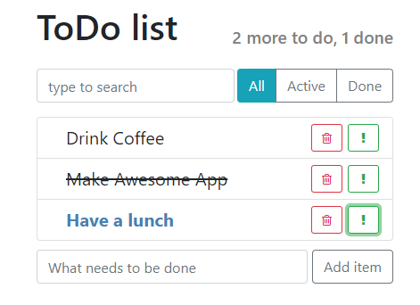

# ToDo React App

## school project within the course React from Yuri Bura

* add and delete items
* mark item as done or important
* finde item
* filter items

## 

##[DEMO](https://voloshin-sergei.github.io/ToDo/)